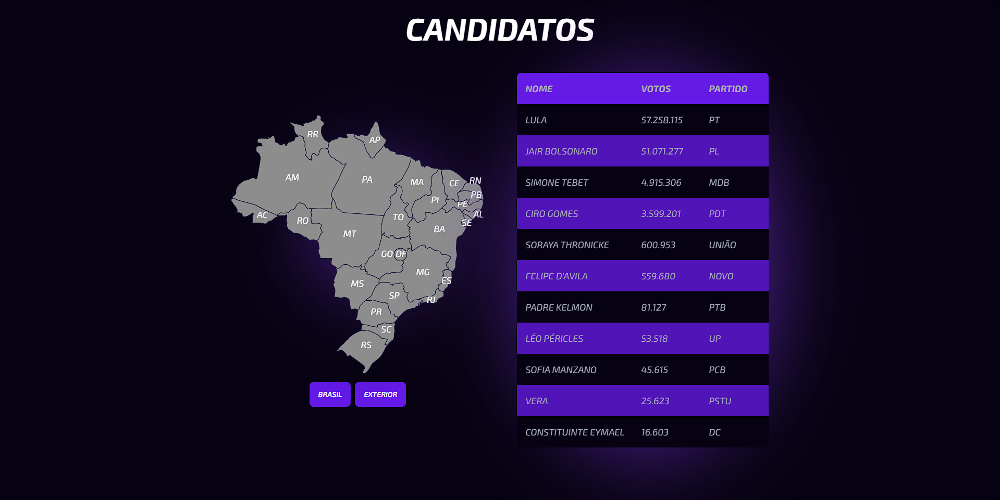

# Brazil Votation Map

🌍 Clique [aqui](https://github.com/Lucasmellof/candidatos/blob/main/README.md) para uma versão em Português(Brasil).

> I made this project to study and play with React, so it should have errors ou better ways to do some stuff. Feel free to open a [Pull Request](https://github.com/Lucasmellof/candidatos/pulls) or create [Issues](https://github.com/Lucasmellof/candidatos/issues/new)

## Technologies used

- [React](https://reactjs.org/);
- [Vite](https://vitejs.dev/);
- [TailWindCSS](https://tailwindcss.com/);
- [React-Table](https://tanstack.com/table/v8).

## How to run
- Clone this repository;
- Install dependencies using `npm install` or `yarn`;
- Open the development server using `npm run dev` or `yarn dev`;

## Credits
- [React-map-Brazil](https://www.npmjs.com/package/react-brazil-map) for creating a Brazil map in SVG;